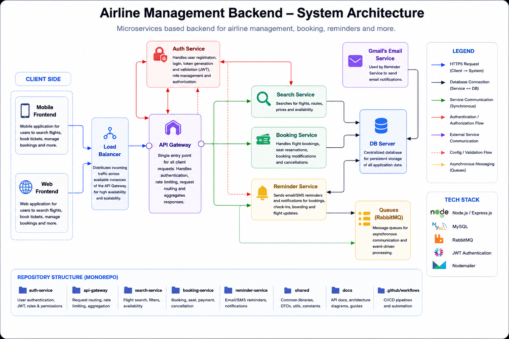

# Airline Management Project Backend

Actual Repo Link from my Github

[Flight_Service](https://github.com/akshaypandey28/Flight_Service.git)

[Booking_Service](https://github.com/akshaypandey28/Flight_Booking_Service.git)

[Auth_Service](https://github.com/akshaypandey28/AuthService.git)

[Reminder_Service](https://github.com/akshaypandey28/Reminder_Service.git)

## Project Overview

This repository contains the backend implementation for an Airline Management System built as a set of Node.js microservices. The architecture is modular and includes separate services for flight management, booking, authentication, and reminders.

The project uses:
- Node.js + Express.js
- Sequelize ORM with MySQL
- JWT-based authentication
- RabbitMQ event messaging for asynchronous booking/reminder flows
- Microservice structure with service-specific routes, controllers, models, and repositories

## Microservices

### 1. Auth Service
- Handles user registration and login
- Provides JWT token creation and validation
- Supports role-based admin checks
- Uses Sequelize models for `User` and `Role`
- Endpoints:
  - `POST /api/v1/signUp` - Register a new user
  - `POST /api/v1/signIn` - Authenticate and generate token
  - `GET /api/v1/isAuthenticated` - Validate JWT token
  - `GET /api/v1/isAdmin` - Check if a user has admin privileges

### 2. Flight Service
- Manages airline flight data, cities, and airports
- Provides CRUD operations for cities, flights, and airport creation
- Uses Sequelize models for `City`, `Airport`, `Airplane`, and `Flights`
- Endpoints:
  - `POST /api/v1/city` - Create a new city
  - `DELETE /api/v1/city/:id` - Delete a city
  - `GET /api/v1/city/:id` - Get a city by ID
  - `PATCH /api/v1/city/:id` - Update a city
  - `GET /api/v1/city` - Get all cities
  - `POST /api/v1/flights` - Create a flight
  - `GET /api/v1/flights` - List all flights
  - `GET /api/v1/flights/:id` - Get flight details
  - `PATCH /api/v1/flights/:id` - Update a flight
  - `POST /api/v1/airports` - Create an airport

### 3. Booking Service
- Handles ticket booking operations
- Persists bookings with flight ID, user ID, seat count, cost, and status
- Includes a message queue publisher to send booking or reminder events
- Endpoints:
  - `POST /api/v1/bookings` - Create a booking record
  - `POST /api/v1/publish` - Publish an event message to RabbitMQ

### 4. Reminder Service
- Listens for booking or notification events from RabbitMQ
- Creates reminder/pending ticket records and can send email notifications
- Uses a queue subscriber to process events such as `CREATE_TICKET` and `SEND_BASIC_MAIL`
- Configured with email credentials and RabbitMQ binding keys

## Architecture & Flow




The backend is designed for a typical airline flow:

1. A user signs up or logs in through **Auth Service**.
2. After login, the user receives a JWT token used for authenticated requests.
3. The user can browse cities, airports, and flights using **Flight Service**.
4. Once a flight is selected, the user creates a booking via **Booking Service**.
5. The booking service can publish a message to a RabbitMQ exchange for asynchronous handling by a reminder or notification service.

This decouples booking operations from reminder delivery and allows the architecture to scale.

## Database Design

### Flight Service
- `City`:
  - `id`, `name` (unique)
  - One city has many airports
- `Airport`:
  - `id`, `name`, `address`, `cityId`
  - Belongs to one city
- `Airplane`:
  - `id`, `modelNumber`, `capacity`
  - One airplane can be associated with multiple flights
- `Flights`:
  - `flightNumber`, `airplaneId`, `departureAirportId`, `arrivalAirportId`, `departureTime`, `arrivalTime`, `price`, `boardingGate`, `totalSeats`

### Auth Service
- `User`:
  - `email` (unique), `password` (bcrypt hashed)
  - Belongs to many `Role` records via `User_Roles`
- `Role`:
  - `name`

### Booking Service
- `Booking`:
  - `flightId`, `userId`, `status`, `noOfSeats`, `totalCost`
  - Tracks booking lifecycle states: `InProcess`, `Booked`, `Cancelled`

## Tech Stack

- Node.js
- Express.js
- Sequelize ORM
- MySQL (via `mysql2`)
- JWT (`jsonwebtoken`)
- bcrypt password hashing
- RabbitMQ (`amqplib`)
- Nodemon for development
- `http-status-codes`
- Email sending via Nodemailer (Reminder Service)

## Setup Guide

### Prerequisites
- Node.js installed
- MySQL database available
- RabbitMQ broker available for booking events

### Installation
Each service is installed individually from its folder.

#### Auth Service
```bash
cd Auth_Service
npm install
```
Create a `.env` file with:
```env
PORT=4000
JWT_KEY=your_jwt_secret
```
Start the service:
```bash
npm start
```

#### Flight Service
```bash
cd Flight_Service
npm install
```
Create a `.env` file with:
```env
PORT=3000
```
Start the service:
```bash
npm run dev
```

#### Booking Service
```bash
cd Booking_Service
npm install
```
Create a `.env` file with:
```env
PORT=5000
MESSAGE_BROKER_URL=amqp://localhost
EXCHANGE_NAME=REMINDER_EXCHANGE
REMINDER_BINDING_KEY=REMINDER_KEY
FLIGHTS_SERVICE_PATH=http://localhost:3000
```
Start the service:
```bash
npm start
```

#### Reminder Service
```bash
cd Reminder_Service
npm install
```
Create a `.env` file with:
```env
PORT=6000
EMAIL_ID=your_email@example.com
EMAIL_PASSWORD=your_email_password
MESSAGE_BROKER_URL=amqp://localhost
EXCHANGE_NAME=REMINDER_EXCHANGE
REMINDER_BINDING_KEY=REMINDER_KEY
```
Start the service:
```bash
npm start
```

## Running Database Migrations

From each service folder:
```bash
npx sequelize db:create
npx sequelize db:migrate
npx sequelize db:seed:all
```

## Project Features

- User registration and authentication with JWT
- Role-based admin validation in Auth Service
- City, airport, and flight management in Flight Service
- Flight creation and retrieval endpoints
- Booking creation and event publishing via RabbitMQ
- Reminder Service event subscription and email workflow
- Microservice organization with separate domain logic

## Notes

- Booking flows can publish messages for reminder or notification processing.
- The Auth Service validates user credentials and issues JWTs.
- Each service exposes APIs under `/api/v1/`.
- Role and admin logic can be extended through `User_Roles` relationships.

## Service Structure

- `Auth_Service/` - authentication and user management
- `Flight_Service/` - flight, city, airport, and airplane management
- `Booking_Service/` - ticket booking and message publishing
- `Reminder_Service/` - supported reminder/notification service (extension point)

## Future Improvements

- Add Swagger/OpenAPI documentation
- Implement full JWT authorization across services
- Add reminder/notification consumers
- Add end-to-end tests and unit tests
- Add booking payment integration

---

For more service-specific details, see the README files inside each service folder.